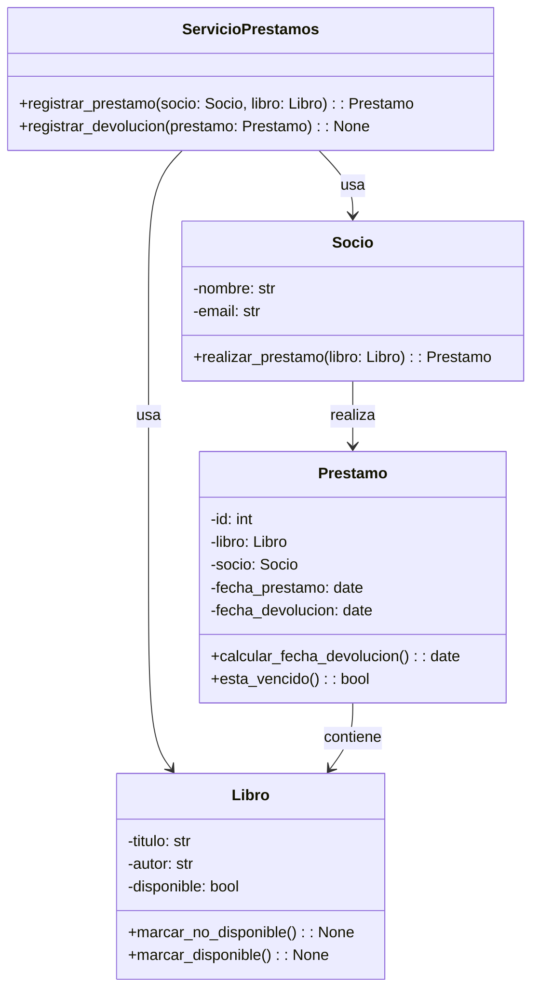

# Diagrama UML - Sistema Biblioteca

```mermaid
classDiagram
    class ServicioPrestamos {
        +registrar_prestamo(socio: Socio, libro: Libro) : Prestamo
        +registrar_devolucion(prestamo: Prestamo) : None
    }

    class Socio {
        -nombre: str
        -email: str
        +realizar_prestamo(libro: Libro) : Prestamo
    }

    class Prestamo {
        -id: int
        -libro: Libro
        -socio: Socio
        -fecha_prestamo: date
        -fecha_devolucion: date
        +calcular_fecha_devolucion() : date
        +esta_vencido() : bool
    }

    class Libro {
        -titulo: str
        -autor: str
        -disponible: bool
        +marcar_no_disponible() : None
        +marcar_disponible() : None
    }

    ServicioPrestamos --> Socio : usa
    ServicioPrestamos --> Libro : usa
    Socio --> Prestamo : realiza
    Prestamo --> Libro : contiene
```
